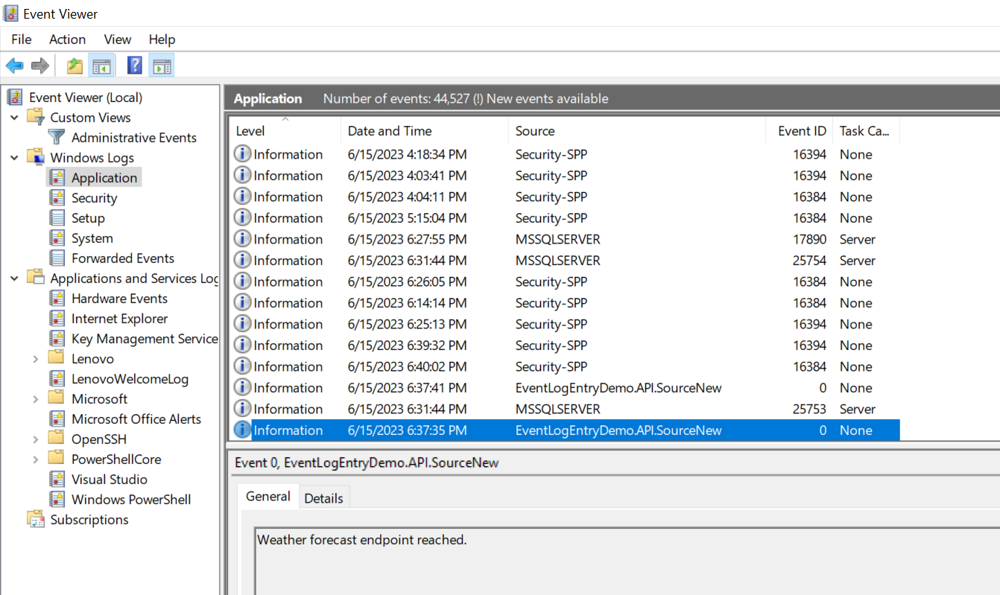

# Event Log Entry Demo

Shows how to write entries to Windows event log via ASP .NET Core application



## Documentation

- https://learn.microsoft.com/en-us/dotnet/api/system.diagnostics.eventlog.writeentry?view=windowsdesktop-7.0
- Create event source: https://stackoverflow.com/a/44565884
- Examples: https://www.infoworld.com/article/3598750/how-to-log-data-to-the-windows-event-log-in-csharp.html

## Nuget packages

### Compile time code style checking

- `Microsoft.CodeAnalysis.NetAnalyzers`

### Unit tests project

- `coverlet.msbuild`
- `coverlet.collector`
- `FluentAssertions`

## Required property groups in project file

```xml

<PropertyGroup>
    <EnableNETAnalyzers>true</EnableNETAnalyzers>
    <AnalysisMode>Recommended</AnalysisMode>
    <EnforceCodeStyleInBuild>true</EnforceCodeStyleInBuild>
</PropertyGroup>
```

## Commands

- `dotnet test -p:CollectCoverage=true -p:CoverletOutputFormat=opencover -p:CoverletOutput=../TestResults`
- `dotnet tool install --global dotnet-reportgenerator-globaltool --version 4.8.6`
- `reportgenerator "-reports:TestResults.opencover.xml" "-targetdir:coveragereport" -reporttypes:Html`
- `dotnet test -p:CollectCoverage=true -p:CoverletOutputFormat=opencover -p:CoverletOutput=TestResults -p:SkipAutoProps=true -p:Threshold=80`

## Sources

- [Defining formatting rules in .NET with EditorConfig](https://blog.genezini.com/p/defining-formatting-rules-in-.net-with-editorconfig)
- [Enforcing .NET code style rules at compile time](https://blog.genezini.com/p/enforcing-.net-code-style-rules-at-compile-time)
- [Analyzing and enforcing .NET code coverage with coverlet](https://blog.genezini.com/p/analyzing-and-enforcing-.net-code-coverage-with-coverlet)
- [SonarCloud via GitHub Actions](https://github.com/kolosovpetro/SonarCloudViaGithubActions)
- [How to build a .NET template and use it within Visual Studio. Part 1: Key concepts](https://www.mytechramblings.com/posts/create-dotnet-templates-for-visual-studio-part-1/)
- [How to build a .NET template and use it within Visual Studio. Part 2: Creating a template package](https://www.mytechramblings.com/posts/create-dotnet-templates-for-visual-studio-part-2/)
